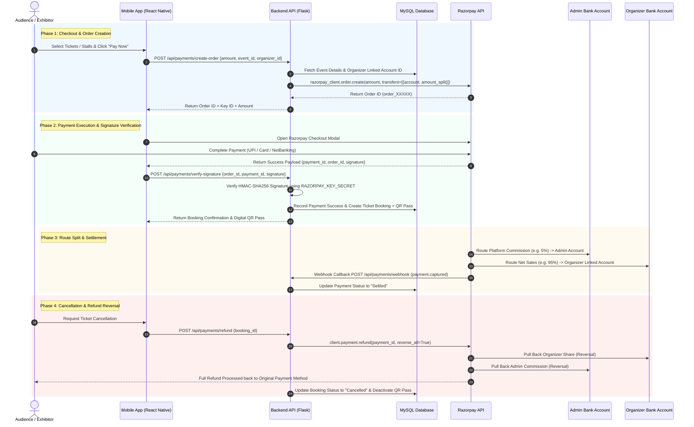

# EventApp Razorpay Route Payment Architecture & Integration Guide

This document explains the complete end-to-end payment, split settlement, refund reversal, and webhook workflow for **BookMyEvent / EventApp** using **Razorpay Route (Model 1 Marketplace)**.

---

## 1. System Architecture & Money Flow Diagram



---

## 2. Low-Level Step-by-Step Payment Breakdown

### Step 1: Order Creation (`POST /api/payments/create-order`)
When a user initiates payment, the mobile app sends a request to the backend. The backend computes the platform commission (e.g., 5%) and organizer share (95%), then calls Razorpay Order API:

**Backend Payload to Razorpay**:
```json
{
  "amount": 100000,
  "currency": "INR",
  "receipt": "rcpt_booking_101",
  "transfers": [
    {
      "account": "acc_organizer_98765",
      "amount": 95000,
      "currency": "INR",
      "on_hold": 0
    }
  ]
}
```

### Step 2: Mobile Checkout Execution
The Mobile App uses `RAZORPAY_KEY_ID` to launch the Razorpay Checkout Modal (via webview / native SDK). The user completes payment using UPI (`success@razorpay`), credit card, or net banking.

### Step 3: Backend HMAC-SHA256 Signature Verification (`POST /api/payments/verify-signature`)
To prevent tampering or spoofed payment success calls, the mobile app sends `order_id`, `payment_id`, and `razorpay_signature` to the backend.
The backend generates an expected signature:
$$\text{expected\_signature} = \text{HMAC-SHA256}(\text{order\_id} + "|" + \text{payment\_id},\, \text{RAZORPAY\_KEY\_SECRET})$$
If $\text{expected\_signature} == \text{razorpay\_signature}$, the payment is authentic. The booking status is marked as `Confirmed` and an encrypted QR ticket pass is generated.

### Step 4: Refund Reversal (`POST /api/payments/refund`)
When a user cancels a booking, the backend issues a refund with `"reverse_all": True`:
```json
{
  "amount": 100000,
  "reverse_all": true
}
```
This automatically reverses the transfer from the organizer's linked account and the admin's commission back to the customer.

---

## 3. Environment Configuration

Ensure the following variables are present in [Backend_page/.env](file:///d:/personal/eventapp/Backend_page/.env):

```env
RAZORPAY_KEY_ID=rzp_test_xxxxxxxxxxxx
RAZORPAY_KEY_SECRET=xxxxxxxxxxxxxxxxxxxxxxxx
RAZORPAY_WEBHOOK_SECRET=eventapp_secret_2026
```

---

## 4. Summary of API Endpoints

| Endpoint | Method | Purpose |
| :--- | :--- | :--- |
| `/api/payments/create-order` | `POST` | Generates a Razorpay Order ID with Route transfer split |
| `/api/payments/verify-signature` | `POST` | Verifies cryptographic signature & confirms booking |
| `/api/payments/refund` | `POST` | Processes ticket cancellation refund with automatic Route reversal |
| `/api/payments/webhook` | `POST` | Listens to Razorpay async events (`payment.captured`, `refund.processed`) |
