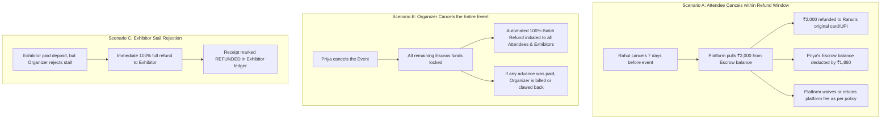
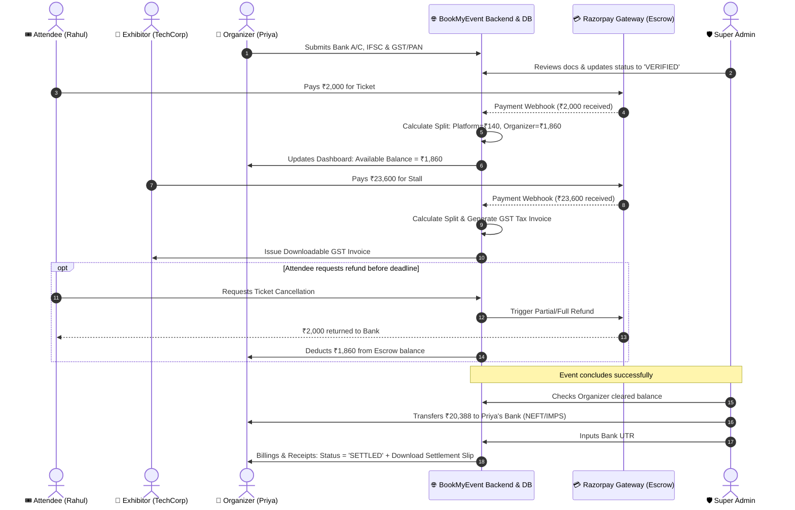

# BookMyEvent — Complete Financial Architecture, Escrow, Split & Refund Guide

## 1. What is an "Escrow"? (In Plain English)

An **Escrow** is a **trusted holding locker** managed by **BookMyEvent**.

When a customer pays ₹1,000 for an event ticket:
* The money does **NOT** transfer directly into the organizer's personal bank account immediately.
* If it did, an unverified organizer could withdraw the money and cancel the event or vanish, leaving attendees demanding refunds from the platform.
* Instead, the money sits safely in **BookMyEvent's central merchant account (the "Escrow Locker")**.
* Once the organizer finishes KYC verification and the event is conducted (or the legal cancellation window passes), your platform unlocks the organizer's net share and transfers it to their bank account.

---

## 2. A Real-World Story: The Full Journey of an Event

Let us follow a realistic end-to-end story with 4 characters:
1. **Priya** — Event Organizer hosting *"Chennai Tech Expo 2026"*
2. **Rahul** — Attendee buying a VIP Ticket for ₹2,000
3. **TechCorp** — Exhibitor renting a premier Stall for ₹20,000
4. **Super Admin** — You / BookMyEvent Platform Administrator

---

### Scene 1: Priya (Organizer) Completes Onboarding & KYC
1. Priya registers on BookMyEvent and creates *"Chennai Tech Expo 2026"*.
2. To receive payouts, Priya visits **Profile ➔ KYC & Bank Details**.
3. She enters:
   * **Company Legal Name & GSTIN / PAN**
   * **Bank Details:** Account Number, Account Holder Name, Bank Name, IFSC Code (`HDFC0001234`), and an uploaded Cancelled Cheque image.
4. **Under the hood:**
   * Priya’s profile status becomes `PENDING_APPROVAL`.
   * Her bank account details are securely stored in the database.
5. Super Admin opens the Admin Panel, verifies her documents, and clicks **"Approve KYC"**. Her status is now **`VERIFIED`**.

---

### Scene 2: Rahul (Attendee) Buys a Ticket for ₹2,000
1. Rahul visits the event page and pays **₹2,000** via UPI / Debit Card.
2. The payment enters **BookMyEvent's Razorpay Account**.
3. **The Instant Split Engine runs:**
   * **Gross Collected:** ₹2,000
   * **Payment Gateway Fee (2%):** ₹40
   * **BookMyEvent Platform Fee (5%):** ₹100
   * **Priya's Net Earnings:** ₹1,860
4. Priya's Organizer Dashboard instantly updates:
   * **Total Sales (Gross GMV):** +₹2,000
   * **Platform Deductions:** +₹140
   * **Organizer Payable (Escrow Balance):** +₹1,860
   * **Status:** `HELD_IN_ESCROW` (Awaiting event completion and settlement schedule)

---

### Scene 3: TechCorp (Exhibitor) Books a Stall for ₹20,000
1. TechCorp applies for a 12 sqm Stall and submits company details with GSTIN.
2. Priya approves the stall request in her Organizer Dashboard.
3. TechCorp pays the invoice: **₹20,000 + 18% GST (₹3,600) = ₹23,600**.
4. The split engine records:
   * **Platform Commission (5% on ₹20,000):** ₹1,000 (+ GST)
   * **Gateway Fee (2%):** ₹472
   * **Priya’s Net Share:** ₹18,528 + Stall GST liability
5. TechCorp’s Exhibitor Dashboard generates an official **GST Tax Invoice** with Priya's and BookMyEvent's GSTIN, allowing TechCorp to claim corporate GST Input Tax Credit (ITC).

---

### Scene 4: How Payouts Are Released to Priya
The event finishes successfully. Priya now has **₹20,388** cleared in her Escrow balance.
* **If KYC was NOT verified:** Priya sees an alert banner: *"Bank verification pending. Payouts locked."*
* **Because KYC is `VERIFIED`:**
  * Super Admin opens **Admin Finance ➔ Payouts Queue**.
  * Clicks **"Disburse Payout"** for Priya (`HDFC Bank A/C ...1234`).
  * Admin enters the Bank UTR / Transaction Reference number (e.g. `UTR9823412093`).
  * Priya receives an email notification: *"₹20,388 has been transferred to your HDFC Bank account."*
  * Priya’s dashboard updates: **Settled Payouts: ₹20,388**, **Available Balance: ₹0**.

---

## 3. What About Refunds? (The 3 Real-World Scenarios)



### Detailed Refund Rules:
1. **Attendee Voluntary Cancellation**:
   * *Before Refund Cutoff (e.g., 48h before event)*: Attendee receives a refund (e.g. 100% or minus nominal gateway charge). The money is refunded directly out of the **Escrow pool** before it reaches the organizer. Priya's "Organizer Payable" simply decreases by ₹1,860.
   * *After Refund Cutoff*: Refund button is disabled; ticket is non-refundable.
2. **Event Cancellation by Organizer**:
   * Because funds remain safely in **Escrow**, BookMyEvent can trigger a 1-click **Bulk Refund** to all ticket holders and exhibitors without needing to recover funds from the organizer's personal bank account.
3. **Exhibitor Stall Rejection**:
   * If an exhibitor paid for a stall and the organizer rejects or downsizes it, the amount is refunded automatically to the exhibitor's original payment method within 5–7 business days.

---

## 4. Payment Gateway & Razorpay Architecture Options

| Option | How It Works | Best For | Extra Setup Required? |
| :--- | :--- | :--- | :--- |
| **Option A: Escrow + Admin Batch Transfer (Recommended)** | All payments collect into your standard BookMyEvent Razorpay Gateway. Your backend tracks Priya's ledger. Admin pays organizers via Corporate Netbanking (NEFT/RTGS) and inputs the UTR. | **Immediate Launch** (Simplest, 0 extra fees) | **No.** Works with your current standard Razorpay API keys! |
| **Option B: Razorpay Route (Marketplace Split)** | You register Priya as a **"Linked Account"** via Razorpay Route API. When Rahul pays, Razorpay splits and transfers directly into Priya's linked account after holding for T+X days. | Mid-scale automated marketplace | Requires activating **"Razorpay Route"** in Razorpay Dashboard and submitting marketplace agreements. |
| **Option C: RazorpayX (Automated Payouts)** | BookMyEvent loads a RazorpayX current account. Your backend makes an API call `POST /v1/payouts` to automatically IMPS transfer funds to Priya's bank account when Admin clicks "Approve". | High volume (1,000+ organizers) | Requires opening a **RazorpayX current account**. |

---

## 5. Complete End-to-End Visual Sequence Diagram



---

## 6. What Each Stakeholder Sees & Needs

### 1. Organizer Side (`/OrganizerHome/Receipt`)
* **KPI Metrics**:
  - `Money Collected (Gross GMV)`
  - `Platform Deductions (Commissions & Gateway Fees)`
  - `Available for Payout (In Escrow)`
  - `Settled Payouts (Bank Transferred)`
* **Data Tables**:
  - **Inward Receipts**: Customer name, ticket type, payment mode, amount, tax, invoice number.
  - **Payout Slips**: Bank name, account ending `...1234`, UTR number, date, status (`SETTLED`).
* **Actions**: Download PDF tax receipt, export Excel sheet.

### 2. Exhibitor Side (`/ExhibitorHome/Billing`)
* **Invoices List**: Stall area, base price, 18% GST breakdown, payment status (`PAID` / `PENDING`).
* **Actions**: Download formal GST Tax Invoice (with BookMyEvent & Organizer GSTIN) for corporate input tax credit.

### 3. Super Admin Side (`/superadmin/finance`)
* **Total Gross GMV**, **Platform Net Revenue**, **Pending Escrow Payouts**.
* **KYC Approvals Queue**: Verify organizer bank details & documents.
* **Payout Disbursement Modal**: Select verified organizers with positive balance, enter bank UTR number, and trigger email receipts.

---

## 7. How Super Admin Executes Payouts & Guarantees Zero Missed Transactions

### A. The Two Disbursement Modes

1. **Assisted Bank Transfer via Platform (Phase 1 - Immediate)**:
   * **Step 1:** Super Admin opens `/superadmin/finance/payouts`.
   * **Step 2:** System lists all organizers eligible for payout with their **Verified Bank Name, Account Number, IFSC, and Cleared Balance**.
   * **Step 3:** Admin clicks **"Initiate Payout"** ➔ Platform displays a 1-click **"Copy Bank Details"** dialog.
   * **Step 4:** Admin transfers the money via Corporate Internet Banking (NEFT/RTGS/IMPS).
   * **Step 5:** Admin pastes the bank **UTR / Transaction Reference Number** (e.g., `HDFC260909123456`) into the platform and clicks **"Confirm Settlement"**.
   * **Step 6:** Platform marks the payout as `SETTLED`, creates an immutable settlement record, deducts the escrow balance, and automatically sends an email settlement slip with UTR to the organizer.

2. **Automated Gateway Payout via API (Phase 2 - RazorpayX / Cashfree)**:
   * Admin clicks **"Approve & Pay"** directly in the dashboard.
   * The platform backend calls the RazorpayX Payout API (`POST /v1/payouts`).
   * The bank auto-transfers the funds instantly via IMPS 24x7 and returns the UTR number automatically to BookMyEvent without manual bank login.

---

### B. The "Zero Missed Transaction" Guarantee (Double-Entry Ledger Architecture)

To ensure **not a single transaction or paisa is ever lost**:

```
                              PAYMENT CAPTURED
                                     │
                    ┌────────────────┴────────────────┐
                    ▼                                 ▼
         CREDIT: Event Escrow Account       CREDIT: Platform Revenue
             (Gross - Deductions)              (Platform Fee + GST)
                    │
           When Payout is Disbursed
                    │
                    ▼
          DEBIT: Event Escrow Account
         CREDIT: Organizer Bank Account (via UTR)
```

1. **Immutable Transaction Log (`event_transactions`)**:
   * Every financial action receives a unique system Transaction ID (`TXN-YYYYMMDD-XXXXX`).
   * Transactions are **append-only** (never deleted or modified).
   * Every row cross-references: `gateway_payment_id`, `gateway_order_id`, `payer_id`, `event_id`, `tax_invoice_id`.

2. **Server-to-Server Webhook Reconciliation (Anti-Drop Protection)**:
   * When an attendee pays on mobile/web, if their internet disconnects or battery dies before redirecting to BookMyEvent, **Razorpay sends a server-to-server webhook directly to our backend (`POST /api/v1/payments/webhook`)**.
   * The backend verifies the cryptographic webhook signature, captures the payment, logs the transaction in the ledger, and emits the ticket—ensuring 100% data integrity even if the user's browser closes.

3. **End-of-Day (EOD) Auto-Reconciliation**:
   * A scheduled background job runs daily at midnight to compare the sum of Razorpay captured charges with the sum of platform `event_transactions`.
   * Any mismatch raises an instant alert on the Super Admin dashboard with variance details.

---

## 8. Summary of Plan Updates to Execute

1. **Backend Database Models**: Create `EventTransaction`, `OrganizerPayout`, and `FinancialInvoice` tables with foreign keys and strict constraints.
2. **Webhook Receiver**: Add `payment.captured` and `refund.processed` signature-verified webhooks in FastAPI.
3. **Organizer Billings UI**: Connect `/OrganizerHome/Receipt` to live backend data with date filtering, UTR lookup, and PDF invoice generation.
4. **Exhibitor Invoices UI**: Add `/ExhibitorHome/Billing` with downloadable GST invoices for tax credit.
5. **Super Admin Payouts Center**: Add `/superadmin/finance/payouts` with KYC verification check, UTR input modal, and CSV export.

